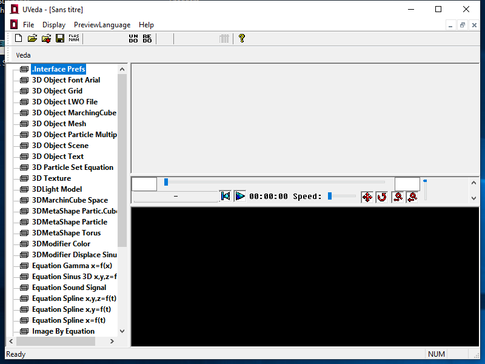

# AzurVeda

AzurVeda is an experimental C++ framework for real-time game and demo development
(OpenGL 3D engine, image, MP3/XM sound, MFC editor), originally written by
Victorien Ferry ([m4nkind.com](https://www.m4nkind.com)).

This edition of the workspace is **Windows 10/11 only**, targets 2026-era tooling
(Visual Studio 2026, C++23), and progressively converts the historical (2003-2007)
code to a modern build chain. See [roadmap.md](roadmap.md) for the full conversion
plan and its progress.

## Modules

| Module | Role | License |
|---|---|---|
| `Veda` | Core library (types, containers, utilities) | LGPL 2.1 |
| `VedaLib3DEngine` | 3D rendering engine | LGPL 2.1 |
| `VedaLibImage` / `VedaLibImageJPEG` | Image loading/processing | LGPL 2.1 |
| `VedaLibMath` | Math library | LGPL 2.1 |
| `VedaLibSoundMP3` | In-house MP3 decoder | **GPL 2** |
| `VedaLibSoundXM` | XM module player | LGPL 2.1 |
| `VedaLibDemo` | Real-time demo utilities | LGPL 2.1 |
| `VedaMachineOGL` | OpenGL rendering backend | LGPL 2.1 |
| `VedaMachineOGLWinDxSound` | DirectSound audio output (Windows) | LGPL 2.1 |
| `VedaGUIWindowsMFC` | Graphical editor (MFC) | **GPL 2** |

> ⚠️ The source code de facto follows the most restrictive license among its
> dependencies (GPL 2) as soon as it links `VedaLibSoundMP3` and/or
> `VedaGUIWindowsMFC`. See `COPYING`.

## Requirements

- Windows 10 or Windows 11
- Visual Studio 2026 ("Desktop development with C++" workload, optional "MFC and
  ATL" component for `VedaGUIWindowsMFC`)
- [vcpkg](https://github.com/microsoft/vcpkg) in manifest mode for external
  dependencies (libjpeg, etc.)
- CMake 3.28+ and Git

## Build

The build uses **CMake + vcpkg** (see [roadmap.md](roadmap.md), Phase 1). The old
Visual Studio .NET 2003 solutions (`VedaWindowsLGPL.sln`, `VedaWindowsGPL.sln`,
`.vcproj` files) are kept for reference until the CMake build has been validated on
a real machine, and will then be removed.

1. Clone the repository: `git clone <repo-url>`
2. Set the `VCPKG_ROOT` environment variable to point to a
   [vcpkg](https://github.com/microsoft/vcpkg) installation (manifest mode — the
   dependencies listed in `vcpkg.json`, e.g. `libjpeg-turbo`, are installed
   automatically at configure time)
3. Configure and build:

```
cmake --preset windows-x64
cmake --build --preset windows-x64-release
```

Useful CMake options:

| Option | Default | Effect |
|---|---|---|
| `AZURVEDA_BUILD_GPL_MODULES` | `ON` | Builds `VedaLibSoundMP3`, `VedaLibDemo`, `VedaGUIWindowsMFC` (GPL 2). `OFF` = LGPL-only build (`windows-x64-lgpl` preset) |
| `AZURVEDA_BUILD_MFC_EDITOR` | `ON` | Builds the `VedaGUIWindowsMFC` editor (requires the optional "MFC and ATL" Visual Studio component) |
| `AZURVEDA_BUILD_EXAMPLES` | `ON` | Builds the `Veda/CodeExamples` samples |

> The `windows-x64` preset's generator (`Visual Studio 18 2026`) is an
> extrapolation of CMake's historical naming scheme (15=2017, 16=2019, 17=2022),
> since Visual Studio 2026 had not shipped yet at the time of this port. Check
> `cmake --help` on your machine and adjust `CMakePresets.json` if the actual name
> differs.

CI (`.github/workflows/ci.yml`) uses a separate preset (`ci-windows-x64`, Ninja
generator) independent of the IDE version installed on the runner.

## Versioning

The project follows [Semantic Versioning](https://semver.org/) (`MAJOR.MINOR.PATCH`):

- The current version number is stored in the [`VERSION`](VERSION) file at the
  root of the repository.
- On every Git tag of the form `vMAJOR.MINOR.PATCH`, that tag becomes the source
  of truth and takes precedence over the `VERSION` file.
- `cmake/GenerateVersion.cmake` automatically generates a `Version.h` header
  (from `cmake/Version.h.in`) on every build, exposing `AZURVEDA_VERSION_STRING`
  and `AZURVEDA_VERSION_GIT_HASH` to the source code.

## Updating the CHANGELOG

[`CHANGELOG.md`](CHANGELOG.md) follows the [Keep a Changelog](https://keepachangelog.com/en/1.1.0/)
format. **Any PR or commit that changes the software's observable behavior must
add an entry to the `[Unreleased]` section** (`Added`, `Changed`, `Fixed`, or
`Removed` category) before being merged. CI (roadmap Phase 1/7) will fail builds
on `main` if `CHANGELOG.md` was not modified in a PR containing functional
changes.

On release, the `[Unreleased]` section is renamed with the version number and
date (`## [MAJOR.MINOR.PATCH] - YYYY-MM-DD`), and a new empty `[Unreleased]`
section is created above it.

## Screenshot



_Update this screenshot whenever a change notably alters the editor's appearance
(see roadmap, Phase 6)._

## License

See [`COPYING`](COPYING) and each module's own `COPYING` file. The workspace
combines LGPL 2.1 and GPL 2 components (see the table above and the "Legal
caveats" section of [roadmap.md](roadmap.md)).
